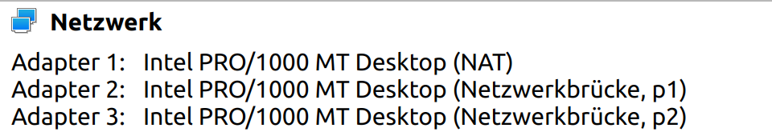

# Bonding setup

## Usecase
This example aims at rebuilding the bonding/link aggregation functionality of VyOS. Bonding is a technology used to increase fault tolerance and load balancing by conbining multiple network interface cards (nics) into one logical. 

The setup is build by two virtual maschines using VirtualBox, which are directly connected to two interfaces of your host system. To prove the increased avaiability of this setup we deactivate one link and still keep the connection to the other OS alive. 

## Configuration

### Adding virtual interfaces 

To create interfaces on the host maschine over which the virtual maschines (VMs) can connect to each other you need to execute the following:
```
ip tuntap add p1 mode tap
ip tuntap add p2 mode tap
```
This adds virtual interfaces to your host which operate at layer 2 and can be used to bridge network traffic.


After you initialized the interfaces you need to activate them.
```
ip link set dev p1 up
ip link set dev p2 up
```

### Settings in VirtualBox

Connecting the VMs to each other you have to add two additional nics to each VM and configure them as shown in the picture. 

The first nic is used for internet connection and the 2nd and 3rd will be used for the bonding.




### Configuration of NixOS

Configuring bonding with the NixOS configuration file can be accomplished in three different ways:
* using systemd.network
* install netplan and configure .yaml
* use NixOS internal networking setction

We chose the third option because it's the simplest and most straightforward approach.

The following network configuration configures the bond interface. First you have to set a hostname and disable the DHCP client for the two interfaces (in this case 'enp0s8' and 'enp0s9'). The third interfaces section configures the 'bond0' interface by setting the IP-address and the subnet and deactivating the DHCP client aswell. The bonds section creates actual bonds with their specific settings. The interfaces option allows you to choose the interfaces that schould be used as slaves by the bond. Within the driverOptions you can configure all the attributes explained in the following manpage. 
[https://www.kernel.org/doc/Documentation/networking/bonding.txt](https://www.kernel.org/doc/Documentation/networking/bonding.txt)

To get everything up and running you need to add this lines to the file at "/etc/nixos/configuration.nix". For the second VM you need to change the hostName and the IP-address of the bond interface (e.g. "192.169.100.3").


```
  networking = {
    hostName = "host-1";
    defaultGateway = "";
    interfaces.enp0s8 = {
      useDHCP = false;
    };
    interfaces.enp0s9 = {
      useDHCP = false;
    };
    interfaces.bond0 = {
      useDHCP = false;
      ipv4.addresses = [{
        address = "192.168.100.2";
        prefixLength = 24;
      }];
    };
    bonds = {
      bond0 = {
        interfaces = [ "enp0s8" "enp0s9" ];
        driverOptions = {
          miimon = "100";
          mode = "active-backup";
          primary = "enp0s8";
          fail_over_mac = "active";
        };
      };
    };
  };
```

After you added this to your configuration.nix file you can run the command to rebuild the system and apply all changes. 

```
sudo nixos-rebuild switch
```

# Testing 
- look up configuration of bond interface 
- deactivate the active slave interface 
- ping still works and active slave has changed

```
ip link set dev enp0s8 down
```

```
cat /proc/net/bonding/bond0
```

- image einfügen

## Problems
- error not entough space left on device  
- nix-collect-garbage, if it does not help new installation with bigger EFI partition https://nixos.org/manual/nix/stable/command-ref/nix-collect-garbage.html 

- Config wurde manchmal nicht übernommen, deshalb neue VM benutzen  
