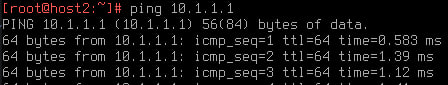
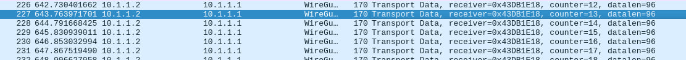
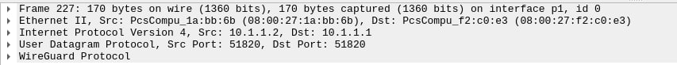
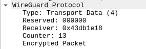

# Site-To-Site Wireguard VPN

## Usecase

By using Wireshark to analyze network traffic between the server and the client, we have verified that the data transmission between the devices is encrypted using Wireguard. This enhances the security and integrity of the transmitted data, ensuring that confidential information remains protected from unauthorized access.

The usecase aims to provide assurance that confidential information is being transmitted safely and that the implemented security measures are functioning as intended.

## Setup

* A server and a client (VMs) are set up in the same network.
* Wireguard is configured and enabled on both devices.
* Wireshark is installed on the analysis device(Host).

## Implementation

## Adding virtual interfaces on the host

We need to add a virtual interface (p1) to the host which operate at layer 2 and can be used to bridge network traffic. We will specify this added port in the network settings of virtual machines and we will select it for analysis with wireshark.

[This adds virtual interfaces to your host which operate at layer 2 and can be used to bridge network traffic.](https://github.com/bluemelov1/KomplRechnernetze/tree/main/szenario1/bonding#adding-virtual-interfaces)

Then we need to install wireguard on both virtual machines 
```
nix-env -iA nixos.wireguard-tools
```
and generate public and private keys.
```
umask 077
mkdir ~/wireguard-keys
wg genkey > ~/wireguard-keys/private
wg pubkey < ~/wireguard-keys/private > ~/wireguard-keys/public
```

### Server configuration
```
  networking = {
    hostName = "host1";
    defaultGateway = "";
    interfaces.enp0s8 = {
      useDHCP = false;
      ipv4.addresses = [{
        address = "10.1.1.1";
        prefixLength = 24;
      }];
    };
  };
 ```
 Using this setting, we assigned a static IP address 10.1.1.1 to the server. The client was assigned IP 10.1.1.2. Then we need to configure the wg0 interface. The wg0 interface is a virtual network interface created by Wireguard. wg0 handles the encapsulation and encryption of network traffic, ensuring that data sent between peers remains confidential, authenticated, and tamper-proof. It serves as the entry point for Wireguard connections.
 ```
  # enable NAT
  networking.nat.enable = true;
  networking.nat.externalInterface = "enp0s8";
  networking.nat.internalInterfaces = [ "wg0" ];
  networking.firewall = {
    allowedUDPPorts = [ 51820 ];
  };

  networking.wireguard.interfaces = {
    # "wg0" is the network interface name.
    wg0 = {
      # Determines the IP address and subnet of the server's end of the tunnel interface.
      ips = [ "10.100.0.1/24" ];
      # The port that WireGuard listens to.
      listenPort = 51820;
      # Path to the private key file.
      privateKeyFile = "/root/wireguard-keys/private";
      # List of allowed peers.
      peers = [ 
        {
          # Public key of the peer 
          publicKey = "+OJZvRhvhX3Bnlvk0uQXALaVDZk0v6PZ9LQMFUe94hI=";
          # List of IPs assigned to this peer within the tunnel subnet. Used to configure routing.
          allowedIPs = [ "10.100.0.2/32" ];
        }
      ];
    };
  };
  
  ```
### Client configuration
```
  networking.firewall = {
    allowedUDPPorts = [ 51820 ]; # Clients and peers can use the same port
  };
  
  networking.wireguard.interfaces = {
    wg0 = {
      # Determines the IP address and subnet of the client's end of the tunnel interface.
      ips = [ "10.100.0.2/24" ];
      listenPort = 51820;
      # Path to the private key file.
      privateKeyFile = "/root/wireguard-keys/private";
      
      peers = [
        { 
          # Public key of the server
          publicKey = "C3XoNS2rRNPW4Dtph7O/cZnURrYv/X1ZMZinHUuhBxc=";
          # Forward only particular subnets
          allowedIPs = [ "10.100.0.1" ];
          endpoint = "10.1.1.1:51820";
          # Send keepalives every 25 seconds
          persistentKeepalive = 25;
        }
      ]; 
    };
  }; 
```  
After all the settings, we need to execute a command 
```
sudo nixos-rebuild switch
```
that "rebuilds the system" and if everything went well, now we can ping the configured wg0 interface.



## Testing with WireShark

After installing wireshark on the host, we need to select the interface created in the previous step and execute the ping command on any of the VMs. We will see the following results:



How can we see the packets are transmitted in encrypted format.




If we ping another interface, the situation will be different. There, the packets are transmitted unencrypted, which allows a third party to take over the data.

### Problems
Since IP addresses were dynamic by default, it was necessary to change this configuration to static for correct operation.

Also when configuring wireguard there were some bugs inside the nixos system. Two machines with exactly the same config produced different results. After a hard reset and a new setup, everything was fixed.
