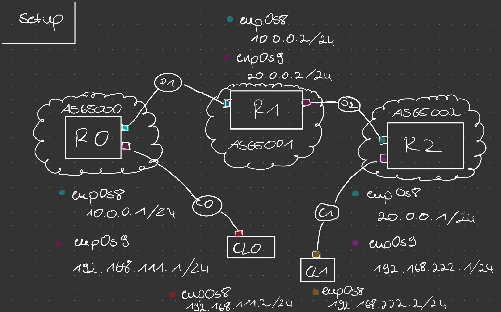
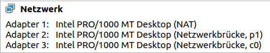
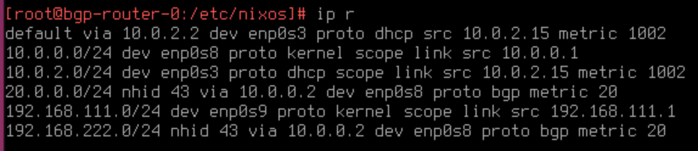
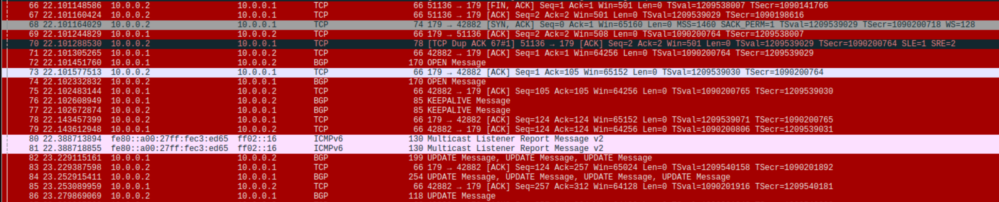
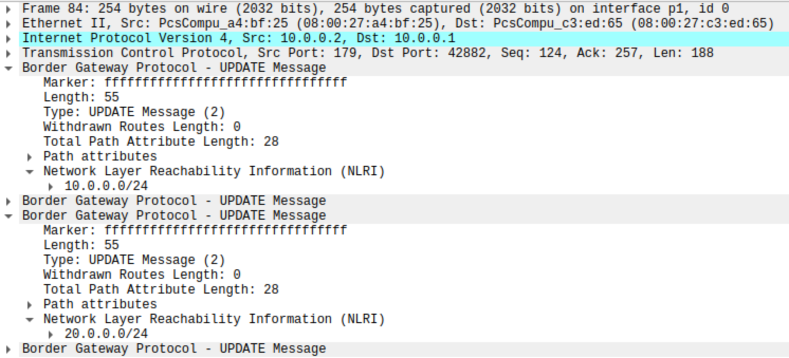

# BGP Router Setup

## Usecase
This example aims at rebuilding the routing functionality of VyOS, especially the BGP protocol. BGP, or Border Gateway Protocol, is the core routing protocol of the Internet that allows autonomous systems to exchange routing information and make decisions about the best paths for data traffic to flow between networks.

The setup is build by five virtual maschines using VirtualBox, these are connected in a line and share a seperate network at each connection. The separation in different networks should virtualize the real world of autonomous systems which are not a complete graph and have to exchange routing information over multiple hops.
The architecture of this example is shown in the following image. The ports (p1,p2,c0,c1) are virtual interfaces on the host maschiene where the VMs can connect to each other and we can use wireshark on them to analyse the traffic.



## Configuration

### Adding virtual interfaces 

To create interfaces on the host maschine over which the virtual maschines (VMs) can connect to each other you need to execute the following:
```
ip tuntap add p1 mode tap
ip tuntap add p2 mode tap
ip tuntap add c0 mode tap
ip tuntap add c1 mode tap
```

This adds virtual interfaces to your host which operate at layer 2 and can be used to bridge network traffic.


After you initialized the interfaces you need to activate them.
```
ip link set dev p1 up
ip link set dev p2 up
ip link set dev c0 up
ip link set dev c1 up
```

### Settings in VirtualBox

The 2nd step is to connect the VMs according to the network achitecture. Therefore we can choose the option "networkbridge" and select the right port. In the image you see the network configuration of the R0 router.




### Configuration of NixOS

For the application of BGP there are two packages supported by NIXOS, which can add this functionality
* BIRD
* FRR

We choose the FRR daemon, but you can also use the BIRD daemon the only difference is their configuration syntax.

You can search for packages that are avaiable for nix on the following website: [NixOS packages](https://search.nixos.org/packages)

Before we can define any configuration for FRR we have to add it to the packages we want to install system wide. in the following example you see that vim and wget are installed togeather with FRR.

```
  environment.systemPackages = with pkgs; [
    vim 
    wget
    frr
  ];
```

Another preparation step is to configure the network interfaces at each VM. The following snippet is an example for the R0 router. Therefore we add the ip addresses to each interface. To allow incomming connections on the port 179 (BGP) we decided to deactivate the firewall completely in our lab environment. Of cause this must be configured differently on a working environment.

```
  networking = {
    hostName = "bgp-router-0";
    defaultGateway = "";
    interfaces.enp0s8 = {
      useDHCP = false;
      ipv4 = {
        addresses = [{
          address = "10.0.0.1";
          prefixLength = 24;
        }];
      };
    };
    interfaces.enp0s9 = {
      useDHCP = false;
      ipv4.addresses = [{
        address = "192.168.111.1";
        prefixLength = 24;
      }];
    };
    firewall.enable = false;
  };
```

After the network setup we have to add the configuration for the bgp daemon. In the following code block you see an example for the R0 router. First we activate the daemon. Secondly we give it the configuration. In the code are comments to explain each line

´´´
  services.frr.bgp = {
    enable = true;
    config = ''
      router bgp 65000                  % Configuring BGP process with autonomous system number 65000
        bgp router-id 10.0.0.1          % Assigning the BGP router ID as 10.0.0.1
        no bgp ebgp-requires-policy     % Disabling the requirement for eBGP peering to have a policy applied
      network 192.168.111.0/24          % Advertising the network 192.168.1.0/24 into BGP routing table
      neighbor 10.0.0.2 remote-as 65001 % Establishing a BGP peering with the neighbor at IP address 10.0.0.2, which belongs to AS 65001
      redistribute connected            % Redistributing connected routes into BGP
    '';
  };
´´´

After you added all the above to your configuration.nix file at '/etc/nixos/' you can run the command to rebuild the system and apply all changes. 

```
sudo nixos-rebuild switch
```

We applay the same confiruation with exchanges ip addresses and AS numbers to the R1 and R2. For the CL0 and CL1 (clients) we just have to configure the network connection and set the default gatway to the connected bgp router. The following code block shows you how we did that.

```
  networking = {
    hostName = "bgp-client-0";
    defaultGateway = "192.168.111.1";
    interfaces.enp0s8 = {
      useDHCP = false;
      ipv4 = {
        addresses = [{
          address = "192.168.111.2";
          prefixLength = 24;
        }];
      };
    };
  };
```

# Testing 
To to make sure the confiruation was successful we have to send a package from CL0 to CL1 and get an answer. We do this by using the following command on the CL0.
```
ping 192.168.222.2
``` 

If the ping succesfully returns everything went well. In the other case we have some options to narrow down the error. 

First we can look at the log messages of the bgp daemon to see if they are running on each router and resolve any errors there. We do this, as all the folloing options, for all routing VM or the network they are connectet to seperately.
```
systemctl --status bgpd.service
```

For further information about the frr configuration you can run:
```
vtysh 
``` 
This opens the commandline for the routing daemon. If you run 
```
show bgp summary
```
you get information about the confirued neighbors and their status which can give you another hint what maybe is wrong.

When looking at the routing tables of the bgp routers all of the networkspaces shown in the following image should be available (The 10.0.2.0 is from VirtualBox and needet for an interent connection but not necessary for our use case.). Notice that they can be routed over different network interfaces on the 3 routers. So it is good as long as the networks have a routing table entry. You can look at them with:

```
ip r
```



The last step to narrow down the error is to sniff on the network links and look at the bgp connection individually. 
Therefore we start wireshark on the host system and listen on the links between the routers. 

A successful connection starts with a TCP handshake, followed by the BGP Open message, some Keepalive messages and the update messages. The following picture shows a succesfull connection.



If you open the update messages and dig into them you should find the anouncement of the other networks. This information is listed unter network layer reachability information.



After you combined all the information of the options before you should be able to resolve the error.

## Problems
While implemnting this szenario we had the problem that sometimes wireshark did not show any packages. To solve that problem you need to restart every VM and wireshark. This also did not happend if you started wireshark first. 

